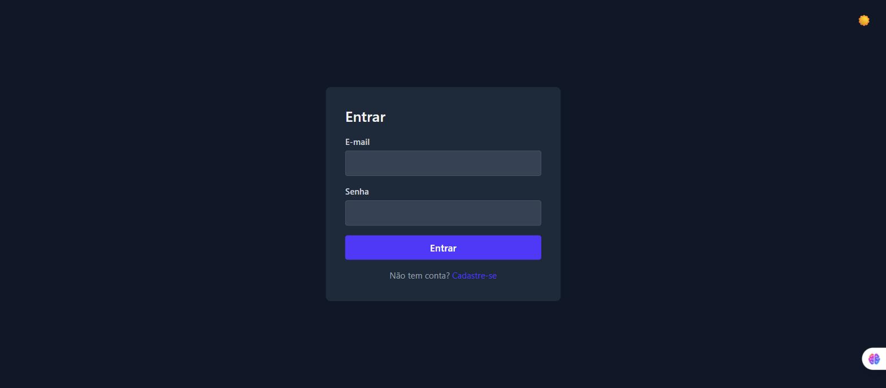
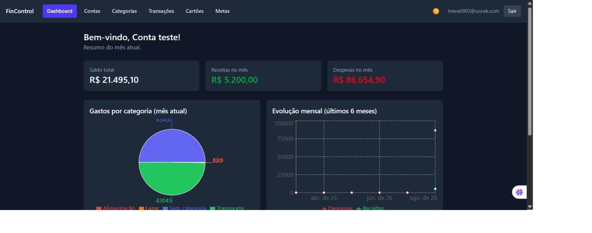
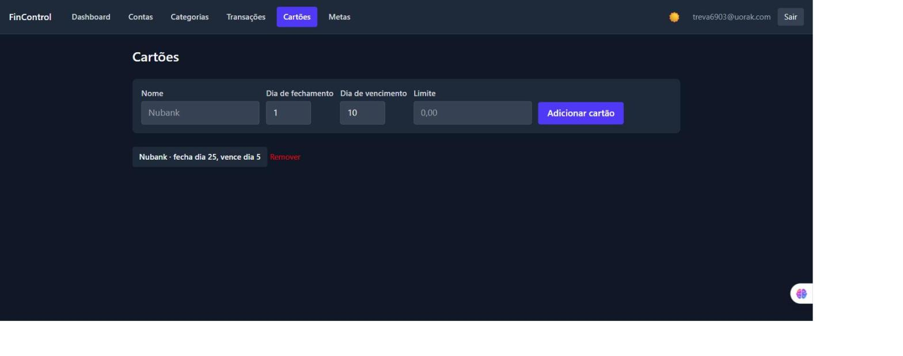
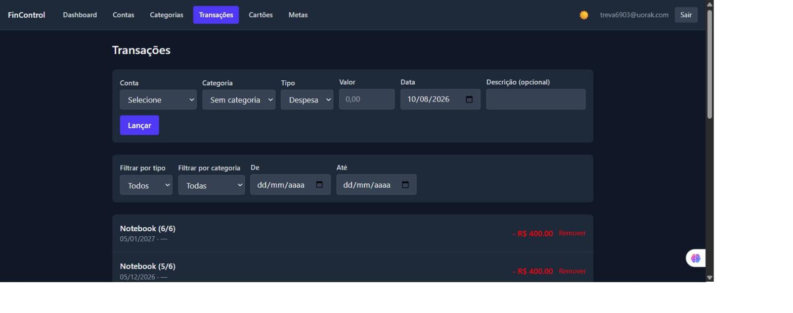

# FinControl

Sistema de controle financeiro pessoal — hospedado na internet, acessível de qualquer lugar.

🌐 **No ar:** https://fin-control-three.vercel.app (cadastro requer código de convite)

**Stack:** React (Vite) no [Vercel](https://vercel.com) + FastAPI no [Render](https://render.com) + Postgres no [Neon](https://neon.tech). Também existe um empacotamento local em `.exe` (PyInstaller + pywebview + SQLite) em `desktop/`, mantido no repositório mas não é mais o jeito recomendado de usar.

> ✅ **MVP completo (Sprints 1–8):** autenticação, contas, categorias, transações, dashboard com gráficos, cartões com parcelamento, metas, modo escuro. Veja o [plano de execução](./PLANO_EXECUCAO.md) completo.
>
> 🎉 **Hospedado (pós-MVP):** saiu do `.exe` local pra rodar sempre no ar, com cadastro aberto por convite. Veja [docs/DEPLOY.md](./docs/DEPLOY.md) pros detalhes operacionais.

## 📸 Demonstração

| Login | Dashboard |
|---|---|
|  |  |

| Cartões (compras parceladas) | Transações |
|---|---|
|  |  |

> Telas de uma conta de demonstração (dados fictícios) — cadastro exige código de convite, então o
> dashboard com dados reais não é público.

## Funcionalidades

- **Autenticação** — cadastro por código de convite, login, JWT com refresh automático, rate limiting contra força bruta
- **Contas** — corrente, poupança, carteira, investimento
- **Categorias e transações** — receitas/despesas categorizadas, com filtros por conta/categoria/tipo/período
- **Dashboard** — saldo total e por conta, gastos por categoria (pizza), evolução mensal (linha)
- **Cartões de crédito** — compras parceladas com cálculo automático de fatura (respeitando dia de fechamento), fatura por mês
- **Metas financeiras** — com barra de progresso e registro de contribuições
- **Modo escuro** — com toggle manual, persistido
- **Responsivo** — funciona também no celular
- **Hospedado** — acessível de qualquer lugar com internet, sem depender do PC ligado

## Como usar

O FinControl roda hospedado (Vercel + Render + Neon) — basta abrir a URL do frontend no navegador
(celular ou computador), cadastrar uma conta e usar. Veja [docs/DEPLOY.md](./docs/DEPLOY.md) pra
como fazer (ou refazer) esse deploy do zero.

## Versão local em `.exe` (legado)

O projeto começou 100% local/offline, empacotado como `.exe` de desktop (`desktop/`) — esse modo
continua no repositório e funciona, mas não é mais o jeito recomendado de usar desde a migração
pra hospedado. Detalhes de como gerar e rodar o `.exe` ficam no final deste README, seção
"Como gerar o `.exe` (legado)".

## Como rodar (desenvolvimento)

Backend:
```bash
cd backend
python -m venv .venv
.venv\Scripts\activate
pip install -r requirements.txt
alembic upgrade head
uvicorn app.main:app --reload
```

Frontend:
```bash
cd frontend
npm install
npm run dev
```

## Como rodar os testes

Backend (67 testes):
```bash
cd backend
.venv\Scripts\python.exe -m pytest
```

Frontend (13 testes):
```bash
cd frontend
npm run test
```

## Como gerar o `.exe` (legado)

```powershell
# 1. Build do frontend
cd frontend
npm run build

# 2. Copia o build pra dentro do backend (o FastAPI serve ele)
Remove-Item -Recurse -Force ..\backend\app\static\* -ErrorAction SilentlyContinue
Copy-Item -Recurse dist\* ..\backend\app\static\

# 3. Instala as dependências extras de empacotamento (fora do requirements.txt do servidor)
cd ..\backend
.venv\Scripts\pip.exe install -r requirements-desktop.txt

# 4. Gera o executável (pasta portátil desktop/dist/FinControl/)
cd ..\desktop
..\backend\.venv\Scripts\pyinstaller.exe build.spec --noconfirm
```

O resultado fica em `desktop/dist/FinControl/` — a pasta inteira é o programa (`FinControl.exe` + arquivos de suporte).

**Pra atualizar uma cópia já em uso** (que já tem `fincontrol.db` com dados de verdade), **não copie a pasta inteira por cima** — isso apaga o banco. Use o script que só troca o programa, preservando os dados, e ainda faz backup automático:

```powershell
# Edite a variável $dst dentro do script pra apontar pra sua cópia em uso
.\update-desktop-copy.ps1
```

Se algo der errado ao abrir o `.exe` (não deveria, mas caso aconteça), o diagnóstico fica em `launcher.log`, criado do lado do `.exe`.

## Estrutura

- `backend/` — API em FastAPI (Postgres em produção via `DATABASE_URL`, SQLite em dev/testes)
- `frontend/` — interface em React
- `desktop/` — empacotamento local em `.exe` (legado: `launcher.py`, `build.spec`, `icon.ico`)
- `docs/` — documentação do projeto, incluindo [DEPLOY.md](./docs/DEPLOY.md)
